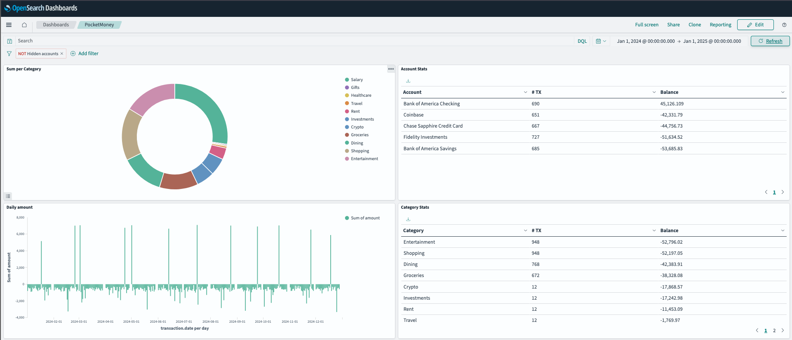

# PocketMoney Dashboards

Pushing [PocketMoney](https://apps.apple.com/us/app/pocketmoney/id1281288102) transactions to `(OpenSearch|PostgreSQL|?)` and visualizing it with `(OpenSearch Dashboards|Grafana|?)`

## Usage

1. Backup DB to iCloud (or Dropbox or whatever)
1. Run `./refresh_from_icloud.py`
    * This looks for a backup in `~/Library/Mobile\ Documents/iCloud\~com\~pocketmoney\~app/Synchronization/...` 
1. Run `utils/db_loader.py pocketmoney.pmdb`
    * This converts the sqlite DB to JSON

Now choose your stack:
* OpenSearch + OpenSearch Dashboards - [opensearch](opensearch/README.md)
* PostgreSQL + Grafana - [postgres](...)

> To use the demo JSON file:
> * Jump straight into the stack (of your choice) README, no need for any of these steps
> 
> 