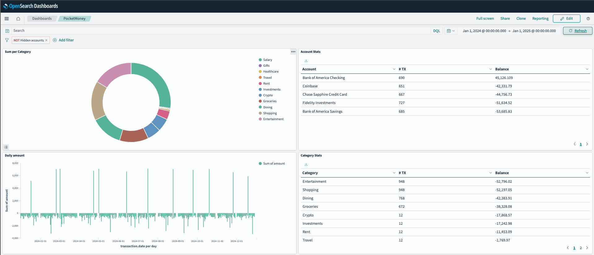

# PocketMoney Dashboards

Pushing [PocketMoney](https://apps.apple.com/us/app/pocketmoney/id1281288102) transactions to `(OpenSearch|PostgreSQL|?)` and visualizing it with `(OpenSearch Dashboards|Grafana|?)`

## Usage

1. Fetch and convert database as per the [main README.md](../README.md)
1. Run `docker compose up -d`
    * Launch local OpenSearch stack
1. Run `./opensearch/push.py pocketmoney_db_dump.json`
    * Imports demo dashboard (`dashboard.ndjson`), (re)creates the index pattern and pushes the JSON data to the local OpenSearch
1. Open http://localhost:5601/app/data-explorer/discover to browse the data
1. Open http://localhost:5601/app/dashboards#/view/45b2c6e0-1f59-11f0-b5b3-23910b0aadc5 for the demo dashboard

> To use the demo JSON file:
> * Jump straight into step 2 (docker compose up)
> * Use `samples/sample_db_dump.json` in step 3
> * Use [this link](http://localhost:5601/app/dashboards#/view/45b2c6e0-1f59-11f0-b5b3-23910b0aadc5?_g=%28filters%3A%21%28%29%2CrefreshInterval%3A%28pause%3A%21t%2Cvalue%3A0%29%2Ctime%3A%28from%3A%272024-01-01T00%3A00%3A00.000Z%27%2Cto%3A%272025-01-01T00%3A00%3A00.000Z%27%29%29) to open the demo dashboard with the pre-defined time range
> 
> 