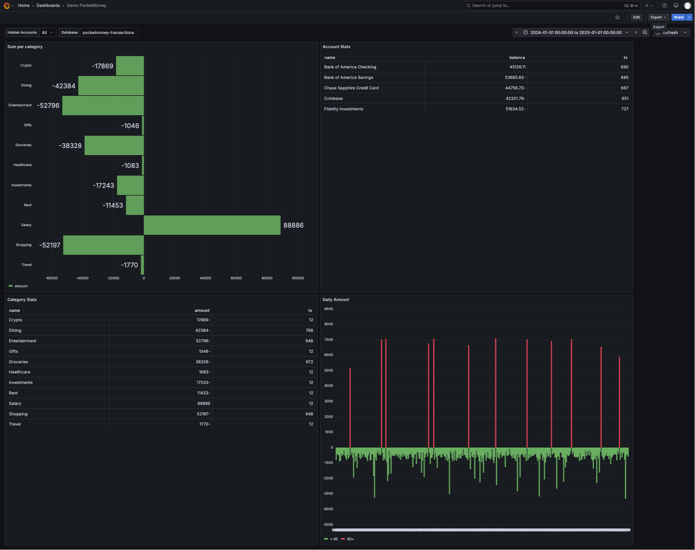

# PocketMoney Dashboards

Pushing [PocketMoney](https://apps.apple.com/us/app/pocketmoney/id1281288102) transactions to `(OpenSearch|PostgreSQL|?)` and visualizing it with `(OpenSearch Dashboards|Grafana|?)`

## Usage

1. Fetch and convert database as per the [main README.md](../README.md)
1. Run `docker compose up -d`
    * Launch local OpenSearch stack
1. Run `./push.py ../pocketmoney_db_dump.json`
    * Imports demo dashboard (`dashboard.ndjson`), (re)creates the index pattern and pushes the JSON data to the local OpenSearch
1. Open http://localhost:5050/browser/ to query the data directly (or use `Explore` in Grafana)
1. Open http://localhost:3000/d/eekvq8dpi7oxsb/demo-pocketmoney for the demo dashboard

> To use the demo JSON file:
> * Jump straight into step 2 (docker compose up)
> * Use `../samples/sample_db_dump.json` in step 3
> * Use [this link](http://localhost:3000/d/eekvq8dpi7oxsb/demo-pocketmoney?orgId=1&from=2024-01-01T00:00:00.000Z&to=2025-01-01T00:00:00.000Z&timezone=browser&var-hidden=$__all&var-database=pocketmoney-transactions) to open the demo dashboard with the pre-defined time range
> 
> 